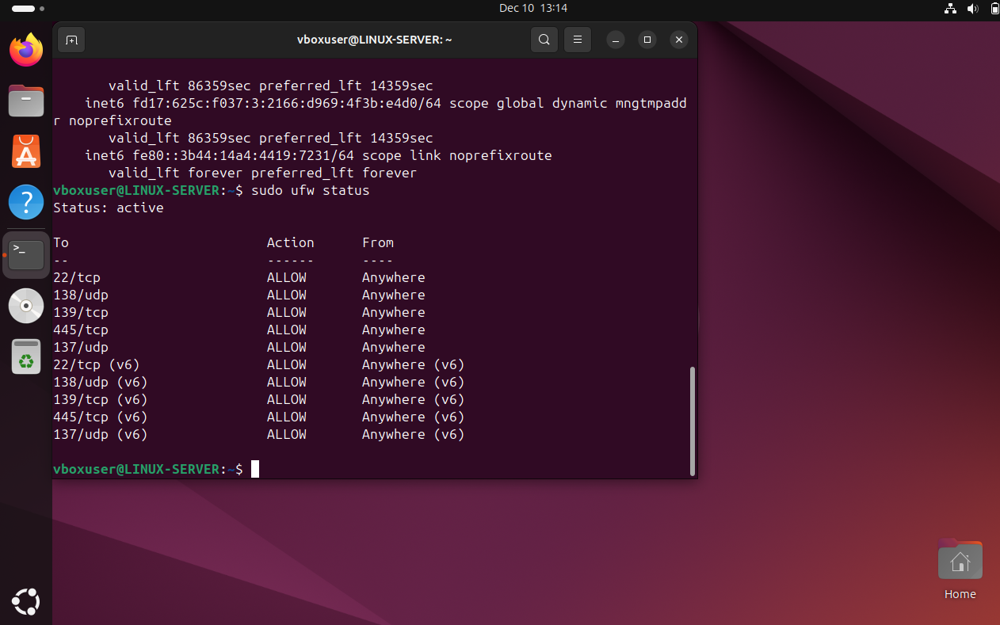
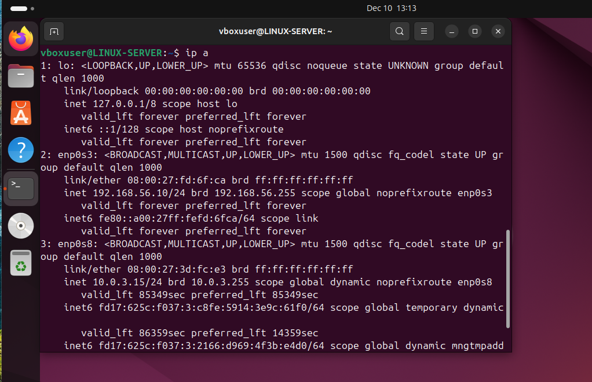
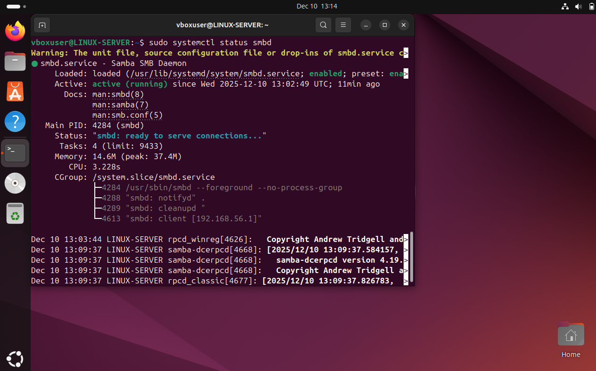
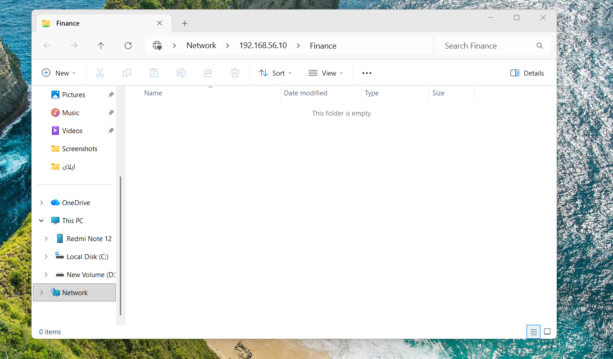
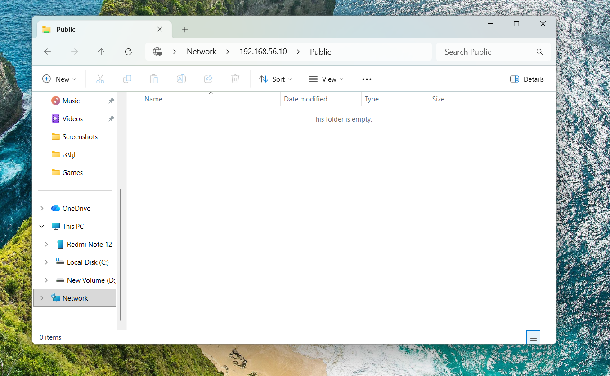
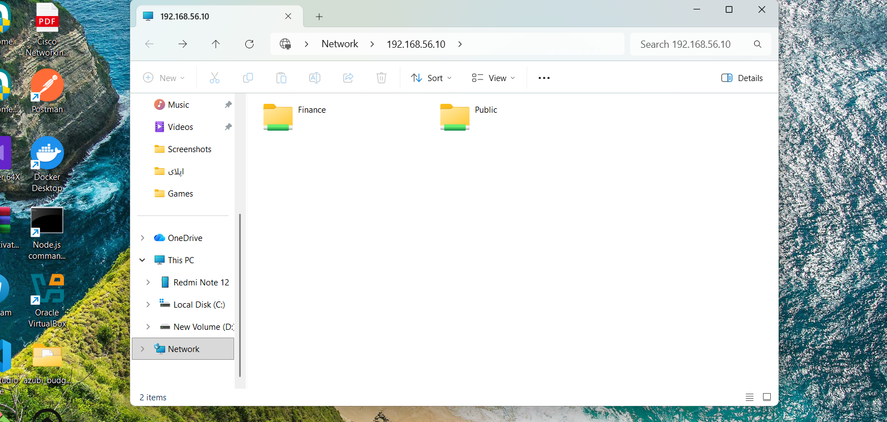

# Virtual Corporate Linux Network  
*Virtuelles Unternehmensnetzwerk mit Linux-Server*

Dieses Projekt simuliert ein kleines Unternehmensnetzwerk mit einem Linux-Server und mehreren Windows-Clients.  
Es wurde als praxisnahes Trainingsprojekt für die Ausbildung zum **Fachinformatiker für Systemintegration** erstellt.

Ziel ist es, reale Aufgaben aus dem IT-Alltag wie Serverinstallation, Netzwerkaufbau, Benutzer- und Rechteverwaltung, Dateifreigaben sowie IT-Support-Szenarien praktisch umzusetzen und professionell zu dokumentieren.

---

## 🔧 Projektübersicht

Das virtuelle Firmennetzwerk besteht aus:

- 1× Linux Server (Ubuntu)
- 2× Windows Clients
- Internes isoliertes Netzwerk
- Zentraler Dateiserver
- Benutzer- und Rechteverwaltung
- Simulation von IT-Support-Fällen

---

## 🖥️ Systemarchitektur

- **LINUX-SERVER** → Ubuntu Server (Zentrale Administration)
- **CLIENT-01** → Windows Client (Mitarbeiter)
- **CLIENT-02** → Windows Client (Finanzabteilung)

Alle Systeme sind über ein internes virtuelles Netzwerk in VirtualBox miteinander verbunden.

---

## 🌐 Netzwerkkonfiguration

- Internes Netzwerk (VirtualBox Internal Network)
- Statische IP-Adressierung
- Zentrale Dateiablage auf dem Server
- Netzwerkbasierter Zugriff für Clients

---

## 👤 Benutzer- und Rechteverwaltung

- Erstellung mehrerer Benutzerkonten
- Rollenbasierte Zugriffskontrolle
- Getrennte Berechtigungen für:
  - Öffentliche Daten (Public)
  - Finanzabteilung (Finance)
  - Administrator

---

## 📁 Dateiserver-Struktur

- **Public-Ordner** → Zugriff für alle Benutzer  
- **Finance-Ordner** → Zugriff nur für Finanzabteilung und Administrator  

---

## 🔐 Sicherheit

- Absicherung des Servers durch UFW-Firewall  
- Freigabe nur notwendiger Ports (SSH, SMB)  
- Deaktivierung des Gastzugriffs  
- Authentifizierter Zugriff auf sensible Daten  

---

## 💾 Backup-Konzept

- Regelmäßige Sicherung wichtiger Daten  
- Trennung von öffentlichen und sensiblen Daten  
- Schutz vor Datenverlust durch Benutzerfehler  

---

## 🛠️ IT-Support & Fehleranalyse

Im Rahmen dieses Projekts werden typische IT-Support-Fälle simuliert, unter anderem:

- Netzwerkprobleme (keine Verbindung, falsche IP-Konfiguration)
- Zugriffsprobleme auf Netzwerkfreigaben
- Benutzer- und Passwortprobleme
- Leistungs- und Systemprobleme

Jeder Support-Fall wird dokumentiert mit:
- Fehlerbeschreibung  
- Ursachenanalyse  
- Lösung  
- Ergebnis  

---

## 📸 Dokumentation

- Netzwerkkonfiguration  
- Benutzer- und Rechteverwaltung  
- Freigaben und Zugriffsrechte  
- Screenshots der Support-Fälle  

Alle Dateien befinden sich in den Ordnern `docs/` und `screenshots/`.

---

## 🎯 Vermittelte Kompetenzen

- Installation und Administration eines Linux-Servers  
- Integration von Windows-Clients in ein Netzwerk  
- Grundlagen der Netzwerktechnik (TCP/IP)  
- Benutzer- und Berechtigungsmanagement  
- Einrichtung eines Samba-Dateiservers  
- IT-Support & Troubleshooting  
- Technische Dokumentation  

---

## ✅ Eingesetzte Technologien

- VirtualBox  
- Ubuntu Linux  
- Windows 10 / Windows 11  
- TCP/IP Netzwerktechnik  
- Samba (SMB Dateiserver)  
- UFW Firewall  
- Datei- und Rechtemanagement  

---

## 📌 Zweck des Projekts

Dieses Projekt dient der praktischen Vorbereitung auf die Ausbildung zum **Fachinformatiker für Systemintegration** und zur Demonstration realer Systemadministrations- und Netzwerkkenntnisse für Bewerbungen in Deutschland.

---

## 📄 Hinweis für Recruiter

Dieses Projekt zeigt eine realistische Unternehmensumgebung mit praktischer Systemadministration, Netzwerktechnik, Benutzerverwaltung, IT-Support und Fehleranalyse.  
Alle Konfigurationen wurden selbstständig durchgeführt und dokumentiert.

---

## 📸 Screenshots

### 🔐 Firewall Status (UFW)

### 🌐 Statische IP-Adresse (Netplan)

### 📁 Samba Server Status

### 🏢 Windows Zugriff – Finance (geschützt)

### 👥 Windows Zugriff – Public Share

### 🖥️ Windows Netzwerkübersicht (Finance & Public)

---

Dieses Projekt dient als praktischer Nachweis meiner Motivation und Eignung für die Ausbildung zum **Fachinformatiker für Systemintegration**.
